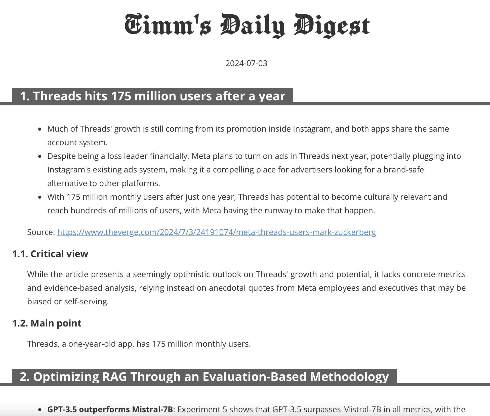

# Daily Digest

Use Generative AI to summarize every article of an RSS feed with 3 different angles to create a very own, newspaper-like experience. Made to be used as an afterburner of [my personal news analysis](https://github.com/heussd/nats-news-analysis).

## Requirements

- [ollama](https://ollama.com/)
- [fivefilters Full Text RSS service](https://github.com/heussd/fivefilters-full-text-rss-docker) (see `compose.yml`)